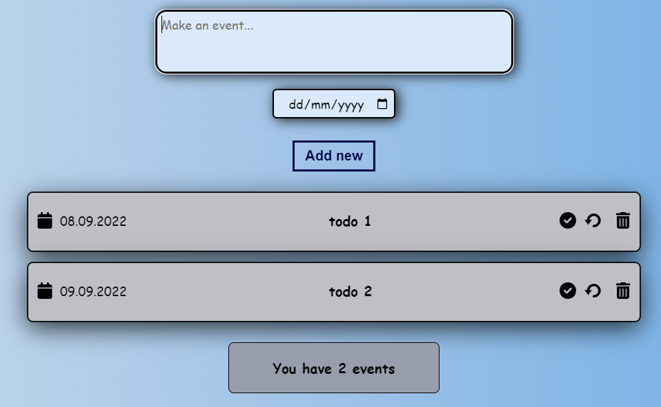

## ToDo App made with React. I'm using json-server and save the data in .json file.



To get a local copy of the code, clone it using git:

```
git clone https://github.com/92gahov/React-Todo-App-3
cd React-Todo-App-3
```

Install dependencies:

```
npm install
npm i concurrently
npm install -g json-server
```

Now, you can start a local web server by running:

```
npm start
```